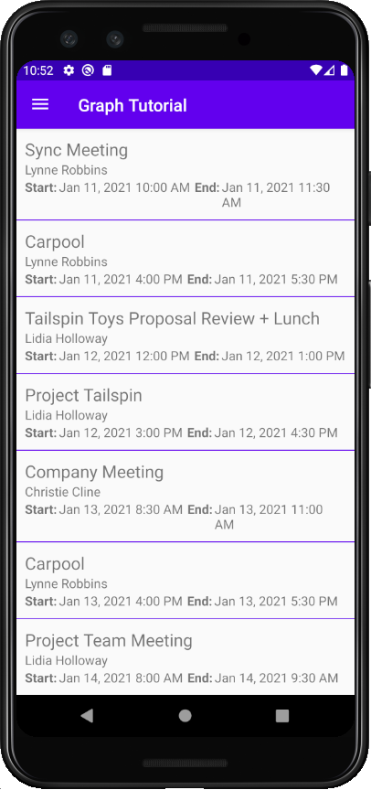

<!-- markdownlint-disable MD002 MD041 -->

<span data-ttu-id="080ce-101">Neste exercício, você incorporará o Microsoft Graph ao aplicativo.</span><span class="sxs-lookup"><span data-stu-id="080ce-101">In this exercise you will incorporate the Microsoft Graph into the application.</span></span> <span data-ttu-id="080ce-102">Para esse aplicativo, você usará o [SDK](https://github.com/microsoftgraph/msgraph-sdk-java) do Microsoft Graph para Java para fazer chamadas para o Microsoft Graph.</span><span class="sxs-lookup"><span data-stu-id="080ce-102">For this application, you will use the [Microsoft Graph SDK for Java](https://github.com/microsoftgraph/msgraph-sdk-java) to make calls to Microsoft Graph.</span></span>

## <a name="get-calendar-events-from-outlook"></a><span data-ttu-id="080ce-103">Obter eventos de calendário do Outlook</span><span class="sxs-lookup"><span data-stu-id="080ce-103">Get calendar events from Outlook</span></span>

<span data-ttu-id="080ce-104">Nesta seção, você estenderá a classe para adicionar uma função para obter os eventos do usuário para a semana atual e atualizar para `GraphHelper` `CalendarFragment` usar essas novas funções.</span><span class="sxs-lookup"><span data-stu-id="080ce-104">In this section you will extend the `GraphHelper` class to add a function to get the user's events for the current week and update `CalendarFragment` to use these new functions.</span></span>

1. <span data-ttu-id="080ce-105">Abra **GraphHelper** e adicione as instruções `import` a seguir na parte superior do arquivo.</span><span class="sxs-lookup"><span data-stu-id="080ce-105">Open **GraphHelper** and add the following `import` statements to the top of the file.</span></span>

    ```java
    import com.microsoft.graph.options.Option;
    import com.microsoft.graph.options.HeaderOption;
    import com.microsoft.graph.options.QueryOption;
    import com.microsoft.graph.requests.extensions.IEventCollectionPage;
    import com.microsoft.graph.requests.extensions.IEventCollectionRequestBuilder;
    import java.time.ZonedDateTime;
    import java.time.format.DateTimeFormatter;
    import java.util.LinkedList;
    import java.util.List;
    ```

1. <span data-ttu-id="080ce-106">Adicione as funções a seguir à `GraphHelper` classe.</span><span class="sxs-lookup"><span data-stu-id="080ce-106">Add the following functions to the `GraphHelper` class.</span></span>

    :::code language="java" source="../demo/GraphTutorial/app/src/main/java/com/example/graphtutorial/GraphHelper.java" id="GetEventsSnippet":::

    > [!NOTE]
    > <span data-ttu-id="080ce-107">Considere o que o código `getCalendarView` está fazendo.</span><span class="sxs-lookup"><span data-stu-id="080ce-107">Consider what the code in `getCalendarView` is doing.</span></span>
    >
    > - <span data-ttu-id="080ce-108">A URL que será chamada é `/v1.0/me/calendarview` .</span><span class="sxs-lookup"><span data-stu-id="080ce-108">The URL that will be called is `/v1.0/me/calendarview`.</span></span>
    >   - <span data-ttu-id="080ce-109">Os `startDateTime` `endDateTime` parâmetros e consulta definem o início e o fim da exibição de calendário.</span><span class="sxs-lookup"><span data-stu-id="080ce-109">The `startDateTime` and `endDateTime` query parameters define the start and end of the calendar view.</span></span>
    >   - <span data-ttu-id="080ce-110">o header faz com que o Microsoft Graph retorne as horas de início e término de cada evento `Prefer: outlook.timezone` no fuso horário do usuário.</span><span class="sxs-lookup"><span data-stu-id="080ce-110">the `Prefer: outlook.timezone` header causes the Microsoft Graph to return the start and end times of each event in the user's time zone.</span></span>
    >   - <span data-ttu-id="080ce-111">A função limita os campos retornados para cada evento a apenas aqueles que o ponto de exibição `select` realmente usará.</span><span class="sxs-lookup"><span data-stu-id="080ce-111">The `select` function limits the fields returned for each events to just those the view will actually use.</span></span>
    >   - <span data-ttu-id="080ce-112">A `orderby` função classifica os resultados por hora de início.</span><span class="sxs-lookup"><span data-stu-id="080ce-112">The `orderby` function sorts the results by start time.</span></span>
    >   - <span data-ttu-id="080ce-113">A `top` função solicita 25 resultados por página.</span><span class="sxs-lookup"><span data-stu-id="080ce-113">The `top` function requests 25 results per page.</span></span>
    > - <span data-ttu-id="080ce-114">Um retorno de chamada é definido ( ) para verificar se há mais resultados disponíveis e `pagingCallback` para solicitar páginas adicionais, se necessário.</span><span class="sxs-lookup"><span data-stu-id="080ce-114">A callback is defined (`pagingCallback`) to check if there are more results available and to request additional pages if needed.</span></span>

1. <span data-ttu-id="080ce-115">Clique com o botão direito do **mouse na pasta app/java/com.example.graphtutorial** e selecione **New**, em seguida, **Classe Java.**</span><span class="sxs-lookup"><span data-stu-id="080ce-115">Right-click the **app/java/com.example.graphtutorial** folder and select **New**, then **Java Class**.</span></span> <span data-ttu-id="080ce-116">Nome da classe `GraphToIana` e selecione **OK**.</span><span class="sxs-lookup"><span data-stu-id="080ce-116">Name the class `GraphToIana` and select **OK**.</span></span>

1. <span data-ttu-id="080ce-117">Abra o novo arquivo e substitua seu conteúdo pelo seguinte.</span><span class="sxs-lookup"><span data-stu-id="080ce-117">Open the new file and replace its contents with the following.</span></span>

    :::code language="java" source="../demo/GraphTutorial/app/src/main/java/com/example/graphtutorial/GraphToIana.java" id="GraphToIanaSnippet":::

1. <span data-ttu-id="080ce-118">Adicione as instruções `import` a seguir na parte superior do arquivo **CalendarFragment.**</span><span class="sxs-lookup"><span data-stu-id="080ce-118">Add the following `import` statements to the top of the **CalendarFragment** file.</span></span>

    ```java
    import android.util.Log;
    import android.widget.ListView;
    import com.google.android.material.snackbar.BaseTransientBottomBar;
    import com.google.android.material.snackbar.Snackbar;
    import com.microsoft.graph.concurrency.ICallback;
    import com.microsoft.graph.core.ClientException;
    import com.microsoft.graph.models.extensions.Event;
    import com.microsoft.identity.client.AuthenticationCallback;
    import com.microsoft.identity.client.IAuthenticationResult;
    import com.microsoft.identity.client.exception.MsalException;
    import java.time.DayOfWeek;
    import java.time.ZoneId;
    import java.time.ZonedDateTime;
    import java.time.temporal.ChronoUnit;
    import java.time.temporal.TemporalAdjusters;
    import java.util.List;
    ```

1. <span data-ttu-id="080ce-119">Adicione o seguinte membro à `CalendarFragment` classe.</span><span class="sxs-lookup"><span data-stu-id="080ce-119">Add the following member to the `CalendarFragment` class.</span></span>

    ```java
    private List<Event> mEventList = null;
    ```

1. <span data-ttu-id="080ce-120">Adicione as seguintes funções à classe `CalendarFragment` para ocultar e mostrar a barra de progresso.</span><span class="sxs-lookup"><span data-stu-id="080ce-120">Add the following functions to the `CalendarFragment` class to hide and show the progress bar.</span></span>

    :::code language="java" source="../demo/GraphTutorial/app/src/main/java/com/example/graphtutorial/CalendarFragment.java" id="ProgressBarSnippet":::

1. <span data-ttu-id="080ce-121">Adicione a função a seguir para fornecer um retorno de chamada para `getCalendarView` a função em `GraphHelper` .</span><span class="sxs-lookup"><span data-stu-id="080ce-121">Add the following function to provide a callback for the `getCalendarView` function in `GraphHelper`.</span></span>

    ```java
    private ICallback<List<Event>> getCalendarViewCallback() {
        return new ICallback<List<Event>>() {
            @Override
            public void success(List<Event> eventList) {
                mEventList = eventList;

                // Temporary for debugging
                String jsonEvents = GraphHelper.getInstance().serializeObject(mEventList);
                Log.d("GRAPH", jsonEvents);

                hideProgressBar();
            }

            @Override
            public void failure(ClientException ex) {
                hideProgressBar();
                Log.e("GRAPH", "Error getting events", ex);
                Snackbar.make(getView(),
                    ex.getMessage(),
                    BaseTransientBottomBar.LENGTH_LONG).show();
            }
        };
    }
    ```

1. <span data-ttu-id="080ce-122">Substitua a função `onCreateView` existente na classe pelo `CalendarFragment` seguinte.</span><span class="sxs-lookup"><span data-stu-id="080ce-122">Replace the existing `onCreateView` function in the `CalendarFragment` class with the following.</span></span>

    :::code language="java" source="../demo/GraphTutorial/app/src/main/java/com/example/graphtutorial/CalendarFragment.java" id="OnCreateViewSnippet":::

    <span data-ttu-id="080ce-123">Observe o que esse código faz.</span><span class="sxs-lookup"><span data-stu-id="080ce-123">Notice what this code does.</span></span> <span data-ttu-id="080ce-124">Primeiro, ele chama `acquireTokenSilently` para obter o token de acesso.</span><span class="sxs-lookup"><span data-stu-id="080ce-124">First, it calls `acquireTokenSilently` to get the access token.</span></span> <span data-ttu-id="080ce-125">Chamar esse método sempre que um token de acesso for necessário é uma prática melhor, pois ele aproveita as capacidades de atualização de token e cache da MSAL.</span><span class="sxs-lookup"><span data-stu-id="080ce-125">Calling this method every time an access token is needed is a best practice because it takes advantage of MSAL's caching and token refresh abilities.</span></span> <span data-ttu-id="080ce-126">Internamente, a MSAL verifica se há um token armazenado em cache e verifica se ele expirou.</span><span class="sxs-lookup"><span data-stu-id="080ce-126">Internally, MSAL checks for a cached token, then checks if it is expired.</span></span> <span data-ttu-id="080ce-127">Se o token estiver presente e não tiver expirado, ele apenas retornará o token armazenado em cache.</span><span class="sxs-lookup"><span data-stu-id="080ce-127">If the token is present and not expired, it just returns the cached token.</span></span> <span data-ttu-id="080ce-128">Se ele tiver expirado, ele tentará atualizar o token antes de revolvê-lo.</span><span class="sxs-lookup"><span data-stu-id="080ce-128">If it is expired, it attempts to refresh the token before returning it.</span></span>

    <span data-ttu-id="080ce-129">Depois que o token é recuperado, o código chama o `getCalendarView` método para obter os eventos do usuário.</span><span class="sxs-lookup"><span data-stu-id="080ce-129">Once the token is retrieved, the code then calls the `getCalendarView` method to get the user's events.</span></span>

1. <span data-ttu-id="080ce-130">Execute o aplicativo, entre e toque no item **de** navegação calendário no menu.</span><span class="sxs-lookup"><span data-stu-id="080ce-130">Run the app, sign in, and tap the **Calendar** navigation item in the menu.</span></span> <span data-ttu-id="080ce-131">Você deverá ver um despejo JSON dos eventos no log de depuração no Android Studio.</span><span class="sxs-lookup"><span data-stu-id="080ce-131">You should see a JSON dump of the events in the debug log in Android Studio.</span></span>

## <a name="display-the-results"></a><span data-ttu-id="080ce-132">Exibir os resultados</span><span class="sxs-lookup"><span data-stu-id="080ce-132">Display the results</span></span>

<span data-ttu-id="080ce-133">Agora você pode substituir o despejo JSON por algo para exibir os resultados de maneira amigável.</span><span class="sxs-lookup"><span data-stu-id="080ce-133">Now you can replace the JSON dump with something to display the results in a user-friendly manner.</span></span> <span data-ttu-id="080ce-134">Nesta seção, você adicionará um ao fragmento de calendário, criará um layout para cada item no e criará um adaptador de lista personalizado para o que mapeia os campos de cada um para o apropriado na `ListView` `ListView` `ListView` `Event` `TextView` exibição.</span><span class="sxs-lookup"><span data-stu-id="080ce-134">In this section, you will add a `ListView` to the calendar fragment, create a layout for each item in the `ListView`, and create a custom list adapter for the `ListView` that maps the fields of each `Event` to the appropriate `TextView` in the view.</span></span>

1. <span data-ttu-id="080ce-135">Substitua o `TextView` **aplicativo/res/layout/fragment_calendar.xml** por `ListView` um .</span><span class="sxs-lookup"><span data-stu-id="080ce-135">Replace the `TextView` in **app/res/layout/fragment_calendar.xml** with a `ListView`.</span></span>

    :::code language="xml" source="../demo/GraphTutorial/app/src/main/res/layout/fragment_calendar.xml" highlight="6-11":::

1. <span data-ttu-id="080ce-136">Clique com o botão direito do **mouse na pasta app/res/layout** e selecione **Novo** e, em seguida, arquivo de **recurso layout.**</span><span class="sxs-lookup"><span data-stu-id="080ce-136">Right-click the **app/res/layout** folder and select **New**, then **Layout resource file**.</span></span>

1. <span data-ttu-id="080ce-137">Nome do `event_list_item` arquivo, altere **o elemento Root** para e selecione `RelativeLayout` **OK**.</span><span class="sxs-lookup"><span data-stu-id="080ce-137">Name the file `event_list_item`, change the **Root element** to `RelativeLayout`, and select **OK**.</span></span>

1. <span data-ttu-id="080ce-138">Abra o **event_list_item.xml** arquivo e substitua seu conteúdo pelo seguinte.</span><span class="sxs-lookup"><span data-stu-id="080ce-138">Open the **event_list_item.xml** file and replace its contents with the following.</span></span>

    :::code language="xml" source="../demo/GraphTutorial/app/src/main/res/layout/event_list_item.xml":::

1. <span data-ttu-id="080ce-139">Clique com o botão direito do **mouse na pasta app/java/com.example.graphtutorial** e selecione **New**, em seguida, **Classe Java.**</span><span class="sxs-lookup"><span data-stu-id="080ce-139">Right-click the **app/java/com.example.graphtutorial** folder and select **New**, then **Java Class**.</span></span>

1. <span data-ttu-id="080ce-140">Nome da classe `EventListAdapter` e selecione **OK**.</span><span class="sxs-lookup"><span data-stu-id="080ce-140">Name the class `EventListAdapter` and select **OK**.</span></span>

1. <span data-ttu-id="080ce-141">Abra o **arquivo EventListAdapter** e substitua seu conteúdo pelo seguinte.</span><span class="sxs-lookup"><span data-stu-id="080ce-141">Open the **EventListAdapter** file and replace its contents with the following.</span></span>

    :::code language="java" source="../demo/GraphTutorial/app/src/main/java/com/example/graphtutorial/EventListAdapter.java" id="EventListAdapterSnippet":::

1. <span data-ttu-id="080ce-142">Abra a **classe CalendarFragment** e adicione a seguinte função à classe.</span><span class="sxs-lookup"><span data-stu-id="080ce-142">Open the **CalendarFragment** class and add the following function to the class.</span></span>

    :::code language="java" source="../demo/GraphTutorial/app/src/main/java/com/example/graphtutorial/CalendarFragment.java" id="AddEventsToListSnippet":::

1. <span data-ttu-id="080ce-143">Substitua o código de depuração temporário da `success` substituição por `addEventsToList();` .</span><span class="sxs-lookup"><span data-stu-id="080ce-143">Replace the temporary debugging code from the `success` override with `addEventsToList();`.</span></span>

    :::code language="java" source="../demo/GraphTutorial/app/src/main/java/com/example/graphtutorial/CalendarFragment.java" id="SuccessSnippet" highlight="5":::

1. <span data-ttu-id="080ce-144">Execute o aplicativo, entre e toque no item **de navegação** calendário.</span><span class="sxs-lookup"><span data-stu-id="080ce-144">Run the app, sign in, and tap the **Calendar** navigation item.</span></span> <span data-ttu-id="080ce-145">Você deverá ver a lista de eventos.</span><span class="sxs-lookup"><span data-stu-id="080ce-145">You should see the list of events.</span></span>

    
