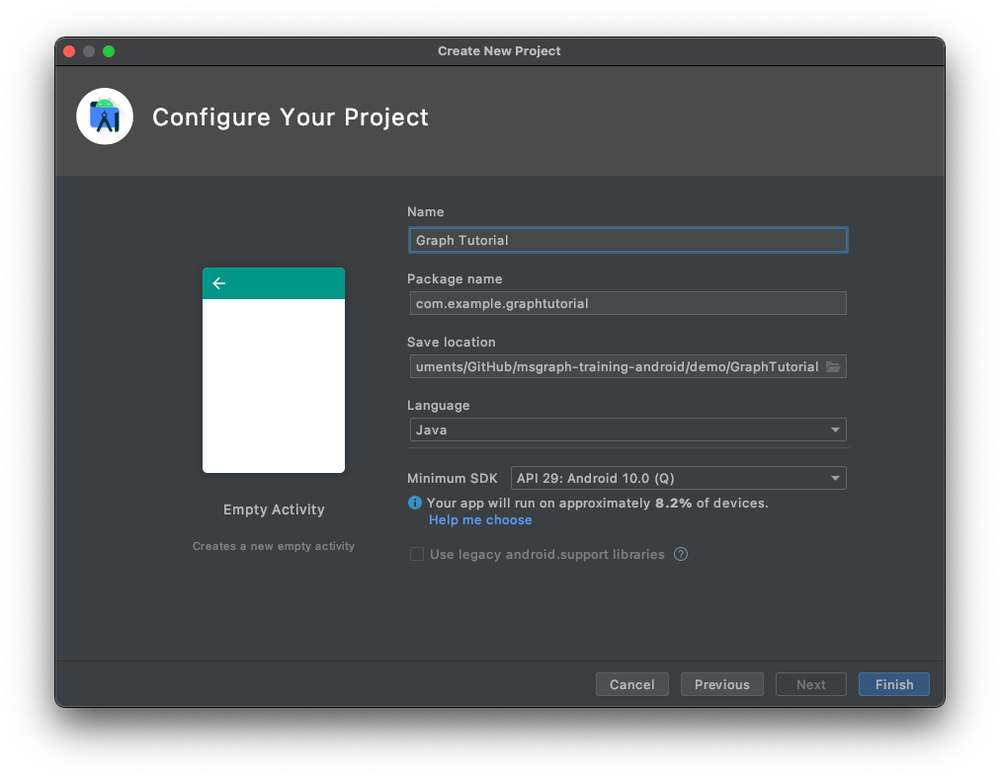

<!-- markdownlint-disable MD002 MD041 -->

<span data-ttu-id="674fe-101">Abra Android Studio e selecione **Iniciar um novo projeto do Android Studio** na tela de boas-vindas.</span><span class="sxs-lookup"><span data-stu-id="674fe-101">Open Android Studio, and select **Start a new Android Studio project** on the welcome screen.</span></span> <span data-ttu-id="674fe-102">Na caixa de diálogo **criar novo projeto** , selecione **atividade vazia**e, em seguida, escolha **Avançar**.</span><span class="sxs-lookup"><span data-stu-id="674fe-102">In the **Create New Project** dialog, select **Empty Activity**, then choose **Next**.</span></span>


<span data-ttu-id="674fe-104">Na caixa de diálogo **Configurar o projeto** , defina \*\*\*\* o nome `Graph Tutorial`como, verifique se o campo de idioma `Java`está definido como e se o nível de **API mínimo** está definido como. \*\*\*\* `API 27: Android 8.1 (Oreo)`</span><span class="sxs-lookup"><span data-stu-id="674fe-104">In the **Configure your project** dialog, set the **Name** to `Graph Tutorial`, ensure the **Language** field is set to `Java`, and ensure the **Minimum API level** is set to `API 27: Android 8.1 (Oreo)`.</span></span> <span data-ttu-id="674fe-105">Modifique o **nome do pacote** e **salve o local** conforme necessário.</span><span class="sxs-lookup"><span data-stu-id="674fe-105">Modify the **Package name** and **Save location** as needed.</span></span> <span data-ttu-id="674fe-106">Selecione **Concluir**.</span><span class="sxs-lookup"><span data-stu-id="674fe-106">Select **Finish**.</span></span>



> [!IMPORTANT]
> <span data-ttu-id="674fe-108">Certifique-se de inserir exatamente o mesmo nome para o projeto especificado nas instruções do laboratório.</span><span class="sxs-lookup"><span data-stu-id="674fe-108">Ensure that you enter the exact same name for the project that is specified in these lab instructions.</span></span> <span data-ttu-id="674fe-109">O nome do projeto se torna parte do namespace no código.</span><span class="sxs-lookup"><span data-stu-id="674fe-109">The project name becomes part of the namespace in the code.</span></span> <span data-ttu-id="674fe-110">O código dentro dessas instruções depende do namespace correspondente ao nome do projeto especificado nessas instruções.</span><span class="sxs-lookup"><span data-stu-id="674fe-110">The code inside these instructions depends on the namespace matching the project name specified in these instructions.</span></span> <span data-ttu-id="674fe-111">Se você usar um nome de projeto diferente, o código não será compilado, a menos que você ajuste todos os namespaces para corresponder ao nome do projeto que você inseriu ao criar o projeto.</span><span class="sxs-lookup"><span data-stu-id="674fe-111">If you use a different project name the code will not compile unless you adjust all the namespaces to match the project name you enter when you create the project.</span></span>

<span data-ttu-id="674fe-112">Antes de prosseguir, instale algumas dependências adicionais que serão usadas posteriormente.</span><span class="sxs-lookup"><span data-stu-id="674fe-112">Before moving on, install some additional dependencies that you will use later.</span></span>

- <span data-ttu-id="674fe-113">`com.android.support:design`disponibilizar os layouts de gaveta de navegação para o aplicativo.</span><span class="sxs-lookup"><span data-stu-id="674fe-113">`com.android.support:design` to make the navigation drawer layouts available to the app.</span></span>
- <span data-ttu-id="674fe-114">A [biblioteca de autenticação da Microsoft (MSAL) para Android](https://github.com/AzureAD/microsoft-authentication-library-for-android) para lidar com a autenticação do Azure AD e o gerenciamento de tokens.</span><span class="sxs-lookup"><span data-stu-id="674fe-114">[Microsoft Authentication Library (MSAL) for Android](https://github.com/AzureAD/microsoft-authentication-library-for-android) to handle Azure AD authentication and token management.</span></span>
- <span data-ttu-id="674fe-115">[SDK do Microsoft Graph para Java](https://github.com/microsoftgraph/msgraph-sdk-java) para fazer chamadas para o Microsoft Graph.</span><span class="sxs-lookup"><span data-stu-id="674fe-115">[Microsoft Graph SDK for Java](https://github.com/microsoftgraph/msgraph-sdk-java) for making calls to the Microsoft Graph.</span></span>

<span data-ttu-id="674fe-116">Expanda **scripts do gradle**e, em seguida, abra o arquivo **Build. gradle (módulo: app)** .</span><span class="sxs-lookup"><span data-stu-id="674fe-116">Expand **Gradle Scripts**, then open the **build.gradle (Module: app)** file.</span></span> <span data-ttu-id="674fe-117">Adicione as seguintes linhas dentro do `dependencies` valor.</span><span class="sxs-lookup"><span data-stu-id="674fe-117">Add the following lines inside the `dependencies` value.</span></span>

```Gradle
implementation 'com.android.support:design:28.0.0'
implementation 'com.microsoft.graph:microsoft-graph:1.1.+'
implementation 'com.microsoft.identity.client:msal:0.2.+'
```

> [!NOTE]
> <span data-ttu-id="674fe-118">Se você estiver usando uma versão diferente do SDK, certifique-se de `28.0.0` alterar o para corresponder à versão `com.android.support:appcompat-v7` da dependência já presente em **Build. gradle**.</span><span class="sxs-lookup"><span data-stu-id="674fe-118">If you are using a different SDK version, make sure to change the `28.0.0` to match the version of the `com.android.support:appcompat-v7` dependency already present in **build.gradle**.</span></span>

<span data-ttu-id="674fe-119">Adicione um `packagingOptions` dentro do `android` valor no arquivo **Build. gradle (Module: app)** .</span><span class="sxs-lookup"><span data-stu-id="674fe-119">Add a `packagingOptions` inside the `android` value in the **build.gradle (Module: app)** file.</span></span>

```Gradle
packagingOptions {
    pickFirst 'META-INF/jersey-module-version'
}
```

<span data-ttu-id="674fe-120">Salve suas alterações.</span><span class="sxs-lookup"><span data-stu-id="674fe-120">Save your changes.</span></span> <span data-ttu-id="674fe-121">No menu **arquivo** , selecione **sincronizar projeto com arquivos do gradle**.</span><span class="sxs-lookup"><span data-stu-id="674fe-121">On the **File** menu, select **Sync Project with Gradle Files**.</span></span>

## <a name="design-the-app"></a><span data-ttu-id="674fe-122">Projetar o aplicativo</span><span class="sxs-lookup"><span data-stu-id="674fe-122">Design the app</span></span>

<span data-ttu-id="674fe-123">O aplicativo usará uma [gaveta de navegação](https://developer.android.com/training/implementing-navigation/nav-drawer) para navegar entre diferentes modos de exibição.</span><span class="sxs-lookup"><span data-stu-id="674fe-123">The application will use a [navigation drawer](https://developer.android.com/training/implementing-navigation/nav-drawer) to navigate between different views.</span></span> <span data-ttu-id="674fe-124">Nesta etapa, você atualizará a atividade para usar um layout de gaveta de navegação e adicionará fragmentos para os modos de exibição.</span><span class="sxs-lookup"><span data-stu-id="674fe-124">In this step you will update the activity to use a navigation drawer layout, and add fragments for the views.</span></span>

### <a name="create-a-navigation-drawer"></a><span data-ttu-id="674fe-125">Criar uma gaveta de navegação</span><span class="sxs-lookup"><span data-stu-id="674fe-125">Create a navigation drawer</span></span>

<span data-ttu-id="674fe-126">Comece criando ícones para o menu de navegação do aplicativo.</span><span class="sxs-lookup"><span data-stu-id="674fe-126">Start by creating icons for the app's navigation menu.</span></span> <span data-ttu-id="674fe-127">Clique com o botão direito do mouse na pasta **app/res/Drawable** e selecione **novo**e, em seguida, **ativo vetorial**.</span><span class="sxs-lookup"><span data-stu-id="674fe-127">Right-click the **app/res/drawable** folder and select **New**, then **Vector Asset**.</span></span> <span data-ttu-id="674fe-128">Clique no botão de ícone ao lado de **Clip-Art**.</span><span class="sxs-lookup"><span data-stu-id="674fe-128">Click the icon button next to **Clip Art**.</span></span> <span data-ttu-id="674fe-129">Na janela **selecionar ícone** , digite `home` na barra de pesquisa e, em seguida, selecione o ícone **página inicial** e escolha **OK**.</span><span class="sxs-lookup"><span data-stu-id="674fe-129">In the **Select Icon** window, type `home` in the search bar, then select the **Home** icon and choose **OK**.</span></span> <span data-ttu-id="674fe-130">Altere o **nome** para `ic_menu_home`.</span><span class="sxs-lookup"><span data-stu-id="674fe-130">Change the **Name** to `ic_menu_home`.</span></span>


<span data-ttu-id="674fe-132">Escolha **Avançar**e **concluir**.</span><span class="sxs-lookup"><span data-stu-id="674fe-132">Choose **Next**, then **Finish**.</span></span> <span data-ttu-id="674fe-133">Repita essa etapa para criar mais dois ícones.</span><span class="sxs-lookup"><span data-stu-id="674fe-133">Repeat this step to create two more icons.</span></span>

- <span data-ttu-id="674fe-134">Nome: `ic_menu_calendar`, ícone:`event`</span><span class="sxs-lookup"><span data-stu-id="674fe-134">Name: `ic_menu_calendar`, Icon: `event`</span></span>
- <span data-ttu-id="674fe-135">Nome: `ic_menu_signout`, ícone:`exit to app`</span><span class="sxs-lookup"><span data-stu-id="674fe-135">Name: `ic_menu_signout`, Icon: `exit to app`</span></span>
- <span data-ttu-id="674fe-136">Nome: `ic_menu_signin`, ícone:`person add`</span><span class="sxs-lookup"><span data-stu-id="674fe-136">Name: `ic_menu_signin`, Icon: `person add`</span></span>

<span data-ttu-id="674fe-137">Em seguida, crie um menu para o aplicativo.</span><span class="sxs-lookup"><span data-stu-id="674fe-137">Next, create a menu for the application.</span></span> <span data-ttu-id="674fe-138">Clique com o botão direito do mouse na pasta **res** e escolha **novo**e, em seguida, **diretório de recursos do Android**.</span><span class="sxs-lookup"><span data-stu-id="674fe-138">Right-click the **res** folder and choose **New**, then **Android Resource Directory**.</span></span> <span data-ttu-id="674fe-139">Altere o **tipo** de recurso `menu` para e escolha **OK**.</span><span class="sxs-lookup"><span data-stu-id="674fe-139">Change the **Resource type** to `menu` and choose **OK**.</span></span>

<span data-ttu-id="674fe-140">Clique com o botão direito do mouse na nova pasta de **menu** e escolha **novo**e, em seguida, **arquivo de recurso de menu**.</span><span class="sxs-lookup"><span data-stu-id="674fe-140">Right-click the new **menu** folder and choose **New**, then **Menu resource file**.</span></span> <span data-ttu-id="674fe-141">Nomeie o arquivo `drawer_menu` e escolha **OK**.</span><span class="sxs-lookup"><span data-stu-id="674fe-141">Name the file `drawer_menu` and choose **OK**.</span></span> <span data-ttu-id="674fe-142">Quando o arquivo for aberto, escolha a guia **texto** para exibir o XML e substitua todo o conteúdo pelo seguinte.</span><span class="sxs-lookup"><span data-stu-id="674fe-142">When the file opens, choose the **Text** tab to view the XML, then replace the entire contents with the following.</span></span>

```xml
<?xml version="1.0" encoding="utf-8"?>
<menu xmlns:android="http://schemas.android.com/apk/res/android"
    xmlns:tools="http://schemas.android.com/tools"
    tools:showIn="navigation_view">

    <group android:checkableBehavior="single">
        <item
            android:id="@+id/nav_home"
            android:icon="@drawable/ic_menu_home"
            android:title="Home" />

        <item
            android:id="@+id/nav_calendar"
            android:icon="@drawable/ic_menu_calendar"
            android:title="Calendar" />
    </group>

    <item android:title="Account">
        <menu>
            <item
                android:id="@+id/nav_signin"
                android:icon="@drawable/ic_menu_signin"
                android:title="Sign In" />

            <item
                android:id="@+id/nav_signout"
                android:icon="@drawable/ic_menu_signout"
                android:title="Sign Out" />
        </menu>
    </item>

</menu>
```

<span data-ttu-id="674fe-143">Agora, atualize o tema do aplicativo para ser compatível com uma gaveta de navegação.</span><span class="sxs-lookup"><span data-stu-id="674fe-143">Now update the application's theme to be compatible with a navigation drawer.</span></span> <span data-ttu-id="674fe-144">Abra o arquivo **app/res/Values. xml** .</span><span class="sxs-lookup"><span data-stu-id="674fe-144">Open the **app/res/values/styles.xml** file.</span></span> <span data-ttu-id="674fe-145">Substituir `Theme.AppCompat.Light.DarkActionBar` por `Theme.AppCompat.Light.NoActionBar`.</span><span class="sxs-lookup"><span data-stu-id="674fe-145">Replace `Theme.AppCompat.Light.DarkActionBar` with `Theme.AppCompat.Light.NoActionBar`.</span></span> <span data-ttu-id="674fe-146">Em seguida, adicione as seguintes linhas `style` dentro do elemento.</span><span class="sxs-lookup"><span data-stu-id="674fe-146">Then add the following lines inside the `style` element.</span></span>

```xml
<item name="windowActionBar">false</item>
<item name="windowNoTitle">true</item>
<item name="android:statusBarColor">@android:color/transparent</item>
```

<span data-ttu-id="674fe-147">Em seguida, crie um cabeçalho para o menu.</span><span class="sxs-lookup"><span data-stu-id="674fe-147">Next, create a header for the menu.</span></span> <span data-ttu-id="674fe-148">Clique com o botão direito do mouse na pasta **app/res/layout** .</span><span class="sxs-lookup"><span data-stu-id="674fe-148">Right-click the **app/res/layout** folder.</span></span> <span data-ttu-id="674fe-149">Escolha **novo**e, em seguida, **arquivo de recurso de layout**.</span><span class="sxs-lookup"><span data-stu-id="674fe-149">Choose **New**, then **Layout resource file**.</span></span> <span data-ttu-id="674fe-150">Nomeie o arquivo `nav_header` e altere o **elemento raiz** para `LinearLayout`.</span><span class="sxs-lookup"><span data-stu-id="674fe-150">Name the file `nav_header` and change the **Root element** to `LinearLayout`.</span></span> <span data-ttu-id="674fe-151">Escolha **OK**.</span><span class="sxs-lookup"><span data-stu-id="674fe-151">Choose **OK**.</span></span>

<span data-ttu-id="674fe-152">Abra o arquivo **nav_header. xml** e escolha a guia **texto** . Substitua todo o conteúdo pelo seguinte.</span><span class="sxs-lookup"><span data-stu-id="674fe-152">Open the **nav_header.xml** file and choose the **Text** tab. Replace the entire contents with the following.</span></span>

```xml
<?xml version="1.0" encoding="utf-8"?>
<<?xml version="1.0" encoding="utf-8"?>
<LinearLayout xmlns:android="http://schemas.android.com/apk/res/android"
    android:layout_width="match_parent"
    android:layout_height="176dp"
    android:background="@color/colorPrimary"
    android:gravity="bottom"
    android:orientation="vertical"
    android:padding="16dp"
    android:theme="@style/ThemeOverlay.AppCompat.Dark">

    <ImageView
        android:id="@+id/user_profile_pic"
        android:layout_width="wrap_content"
        android:layout_height="wrap_content"
        android:src="@mipmap/ic_launcher" />

    <TextView
        android:id="@+id/user_name"
        android:layout_width="wrap_content"
        android:layout_height="wrap_content"
        android:paddingTop="8dp"
        android:text="Test User"
        android:textAppearance="@style/TextAppearance.AppCompat.Body1" />

    <TextView
        android:id="@+id/user_email"
        android:layout_width="wrap_content"
        android:layout_height="wrap_content"
        android:text="test@contoso.com" />

</LinearLayout>
```

<span data-ttu-id="674fe-153">Agora, abra o arquivo **app/res/layout/activity_main. xml** .</span><span class="sxs-lookup"><span data-stu-id="674fe-153">Now, open the **app/res/layout/activity_main.xml** file.</span></span> <span data-ttu-id="674fe-154">Atualize o layout para um `DrawerLayout` substituindo o XML existente pelo seguinte.</span><span class="sxs-lookup"><span data-stu-id="674fe-154">Update the layout to a `DrawerLayout` by replacing the existing XML with the following.</span></span>

```xml
<?xml version="1.0" encoding="utf-8"?>
<android.support.v4.widget.DrawerLayout xmlns:android="http://schemas.android.com/apk/res/android"
    xmlns:app="http://schemas.android.com/apk/res-auto"
    xmlns:tools="http://schemas.android.com/tools"
    android:id="@+id/drawer_layout"
    android:layout_width="match_parent"
    android:layout_height="match_parent"
    android:fitsSystemWindows="true"
    tools:context=".MainActivity"
    tools:openDrawer="start">

    <RelativeLayout
        android:layout_width="match_parent"
        android:layout_height="match_parent"
        android:orientation="vertical">

        <ProgressBar
            android:id="@+id/progressbar"
            android:layout_width="75dp"
            android:layout_height="75dp"
            android:layout_centerInParent="true"
            android:visibility="gone"/>

        <android.support.v7.widget.Toolbar
            android:id="@+id/toolbar"
            android:layout_width="match_parent"
            android:layout_height="?attr/actionBarSize"
            android:background="@color/colorPrimary"
            android:elevation="4dp"
            android:theme="@style/ThemeOverlay.AppCompat.Dark.ActionBar" />

        <FrameLayout
            android:id="@+id/fragment_container"
            android:layout_width="match_parent"
            android:layout_height="match_parent"
            android:layout_below="@+id/toolbar" />
    </RelativeLayout>

    <android.support.design.widget.NavigationView
        android:id="@+id/nav_view"
        android:layout_width="wrap_content"
        android:layout_height="match_parent"
        android:layout_gravity="start"
        app:headerLayout="@layout/nav_header"
        app:menu="@menu/drawer_menu" />

</android.support.v4.widget.DrawerLayout>
```

<span data-ttu-id="674fe-155">Em seguida, abra **app/res/Values/Strings. xml**.</span><span class="sxs-lookup"><span data-stu-id="674fe-155">Next, open **app/res/values/strings.xml**.</span></span> <span data-ttu-id="674fe-156">Adicione os seguintes elementos dentro do `resources` elemento.</span><span class="sxs-lookup"><span data-stu-id="674fe-156">Add the following elements inside the `resources` element.</span></span>

```xml
<string name="navigation_drawer_open">Open navigation drawer</string>
<string name="navigation_drawer_close">Close navigation drawer</string>
```

<span data-ttu-id="674fe-157">Por fim, abra o arquivo **app/Java/com. example/graphtutorial/MainActivity** .</span><span class="sxs-lookup"><span data-stu-id="674fe-157">Finally, open the **app/java/com.example/graphtutorial/MainActivity** file.</span></span> <span data-ttu-id="674fe-158">Substitua todo o conteúdo pelo seguinte.</span><span class="sxs-lookup"><span data-stu-id="674fe-158">Replace the entire contents with the following.</span></span>

```java
package com.example.graphtutorial;

import android.support.annotation.NonNull;
import android.support.design.widget.NavigationView;
import android.support.v4.view.GravityCompat;
import android.support.v4.widget.DrawerLayout;
import android.support.v7.app.ActionBarDrawerToggle;
import android.support.v7.app.AppCompatActivity;
import android.os.Bundle;
import android.support.v7.widget.Toolbar;
import android.view.Menu;
import android.view.MenuItem;
import android.view.View;
import android.widget.TextView;

public class MainActivity extends AppCompatActivity implements NavigationView.OnNavigationItemSelectedListener {
    private DrawerLayout mDrawer;
    private NavigationView mNavigationView;
    private View mHeaderView;
    private boolean mIsSignedIn = false;
    private String mUserName = null;
    private String mUserEmail = null;

    @Override
    protected void onCreate(Bundle savedInstanceState) {
        super.onCreate(savedInstanceState);
        setContentView(R.layout.activity_main);

        // Set the toolbar
        Toolbar toolbar = findViewById(R.id.toolbar);
        setSupportActionBar(toolbar);

        mDrawer = findViewById(R.id.drawer_layout);

        // Add the hamburger menu icon
        ActionBarDrawerToggle toggle = new ActionBarDrawerToggle(this, mDrawer, toolbar,
                R.string.navigation_drawer_open, R.string.navigation_drawer_close);
        mDrawer.addDrawerListener(toggle);
        toggle.syncState();

        mNavigationView = findViewById(R.id.nav_view);

        // Set user name and email
        mHeaderView = mNavigationView.getHeaderView(0);
        setSignedInState(mIsSignedIn);

        // Listen for item select events on menu
        mNavigationView.setNavigationItemSelectedListener(this);
    }

    @Override
    public boolean onNavigationItemSelected(@NonNull MenuItem menuItem) {
        // TEMPORARY
        return false;
    }

    @Override
    public void onBackPressed() {
        if (mDrawer.isDrawerOpen(GravityCompat.START)) {
            mDrawer.closeDrawer(GravityCompat.START);
        } else {
            super.onBackPressed();
        }
    }

    public void showProgressBar()
    {
        FrameLayout container = findViewById(R.id.fragment_container);
        ProgressBar progressBar = findViewById(R.id.progressbar);
        container.setVisibility(View.GONE);
        progressBar.setVisibility(View.VISIBLE);
    }

    public void hideProgressBar()
    {
        FrameLayout container = findViewById(R.id.fragment_container);
        ProgressBar progressBar = findViewById(R.id.progressbar);
        progressBar.setVisibility(View.GONE);
        container.setVisibility(View.VISIBLE);
    }

    // Update the menu and get the user's name and email
    private void setSignedInState(boolean isSignedIn) {
        mIsSignedIn = isSignedIn;

        Menu menu = mNavigationView.getMenu();

        // Hide/show the Sign in, Calendar, and Sign Out buttons
        menu.findItem(R.id.nav_signin).setVisible(!isSignedIn);
        menu.findItem(R.id.nav_calendar).setVisible(isSignedIn);
        menu.findItem(R.id.nav_signout).setVisible(isSignedIn);

        // Set the user name and email in the nav drawer
        TextView userName = mHeaderView.findViewById(R.id.user_name);
        TextView userEmail = mHeaderView.findViewById(R.id.user_email);

        if (isSignedIn) {
            // For testing
            mUserName = "Megan Bowen";
            mUserEmail = "meganb@contoso.com";

            userName.setText(mUserName);
            userEmail.setText(mUserEmail);
        } else {
            mUserName = null;
            mUserEmail = null;

            userName.setText("Please sign in");
            userEmail.setText("");
        }
    }
}
```

### <a name="add-fragments"></a><span data-ttu-id="674fe-159">Adicionar fragmentos</span><span class="sxs-lookup"><span data-stu-id="674fe-159">Add fragments</span></span>

<span data-ttu-id="674fe-160">Clique com o botão direito do mouse na pasta **app/res/layout** e escolha **novo**e, em seguida, **arquivo de recurso de layout**.</span><span class="sxs-lookup"><span data-stu-id="674fe-160">Right-click the **app/res/layout** folder and choose **New**, then **Layout resource file**.</span></span> <span data-ttu-id="674fe-161">Nomeie o arquivo `fragment_home` e altere o **elemento raiz** para `RelativeLayout`.</span><span class="sxs-lookup"><span data-stu-id="674fe-161">Name the file `fragment_home` and change the **Root element** to `RelativeLayout`.</span></span> <span data-ttu-id="674fe-162">Escolha **OK**.</span><span class="sxs-lookup"><span data-stu-id="674fe-162">Choose **OK**.</span></span>

<span data-ttu-id="674fe-163">Abra o arquivo **fragment_home. xml** e substitua seu conteúdo pelo seguinte.</span><span class="sxs-lookup"><span data-stu-id="674fe-163">Open the **fragment_home.xml** file and replace its contents with the following.</span></span>

```xml
<?xml version="1.0" encoding="utf-8"?>
<RelativeLayout xmlns:android="http://schemas.android.com/apk/res/android"
    android:layout_width="match_parent"
    android:layout_height="match_parent">

    <LinearLayout
        android:layout_width="wrap_content"
        android:layout_height="wrap_content"
        android:layout_centerInParent="true"
        android:orientation="vertical">

        <TextView
            android:layout_width="wrap_content"
            android:layout_height="wrap_content"
            android:layout_gravity="center_horizontal"
            android:text="Welcome!"
            android:textSize="30sp" />

        <TextView
            android:id="@+id/home_page_username"
            android:layout_width="wrap_content"
            android:layout_height="wrap_content"
            android:layout_gravity="center_horizontal"
            android:paddingTop="8dp"
            android:text="Please sign in"
            android:textSize="20sp" />
    </LinearLayout>

</RelativeLayout>
```

<span data-ttu-id="674fe-164">Em seguida, clique com o botão direito do mouse na pasta **app/res/layout** e escolha **novo**e, em seguida, **arquivo de recurso de layout**.</span><span class="sxs-lookup"><span data-stu-id="674fe-164">Next, right-click the **app/res/layout** folder and choose **New**, then **Layout resource file**.</span></span> <span data-ttu-id="674fe-165">Nomeie o arquivo `fragment_calendar` e altere o **elemento raiz** para `RelativeLayout`.</span><span class="sxs-lookup"><span data-stu-id="674fe-165">Name the file `fragment_calendar` and change the **Root element** to `RelativeLayout`.</span></span> <span data-ttu-id="674fe-166">Escolha **OK**.</span><span class="sxs-lookup"><span data-stu-id="674fe-166">Choose **OK**.</span></span>

<span data-ttu-id="674fe-167">Abra o arquivo **fragment_calendar. xml** e substitua seu conteúdo pelo seguinte.</span><span class="sxs-lookup"><span data-stu-id="674fe-167">Open the **fragment_calendar.xml** file and replace its contents with the following.</span></span>

```xml
<?xml version="1.0" encoding="utf-8"?>
<RelativeLayout xmlns:android="http://schemas.android.com/apk/res/android"
    android:layout_width="match_parent"
    android:layout_height="match_parent">

    <TextView
        android:layout_width="wrap_content"
        android:layout_height="wrap_content"
        android:layout_centerInParent="true"
        android:text="Calendar"
        android:textSize="30sp" />

</RelativeLayout>
```

<span data-ttu-id="674fe-168">Agora, clique com o botão direito do mouse na pasta **app/Java/com. example. graphtutorial** e escolha **nova**e, em seguida, **classe Java**.</span><span class="sxs-lookup"><span data-stu-id="674fe-168">Now, right-click the **app/java/com.example.graphtutorial** folder and choose **New**, then **Java Class**.</span></span> <span data-ttu-id="674fe-169">Nomeie a classe `HomeFragment` e defina a \*\*\*\* superclasse `android.support.v4.app.Fragment`como.</span><span class="sxs-lookup"><span data-stu-id="674fe-169">Name the class `HomeFragment` and set the **Superclass** to `android.support.v4.app.Fragment`.</span></span> <span data-ttu-id="674fe-170">Escolha **OK**.</span><span class="sxs-lookup"><span data-stu-id="674fe-170">Choose **OK**.</span></span> <span data-ttu-id="674fe-171">Abra o arquivo **HomeFragment** e substitua seu conteúdo pelo seguinte.</span><span class="sxs-lookup"><span data-stu-id="674fe-171">Open the **HomeFragment** file and replace its contents with the following.</span></span>

```java
package com.example.graphtutorial;

import android.os.Bundle;
import android.support.annotation.NonNull;
import android.support.annotation.Nullable;
import android.support.v4.app.Fragment;
import android.view.LayoutInflater;
import android.view.View;
import android.view.ViewGroup;
import android.widget.TextView;

public class HomeFragment extends Fragment {
    private static final String USER_NAME = "userName";

    private String mUserName;

    public HomeFragment() {

    }

    public static HomeFragment createInstance(String userName) {
        HomeFragment fragment = new HomeFragment();

        // Add the provided username to the fragment's arguments
        Bundle args = new Bundle();
        args.putString(USER_NAME, userName);
        fragment.setArguments(args);
        return fragment;
    }

    @Override
    public void onCreate(@Nullable Bundle savedInstanceState) {
        super.onCreate(savedInstanceState);
        if (getArguments() != null) {
            mUserName = getArguments().getString(USER_NAME);
        }
    }

    @Nullable
    @Override
    public View onCreateView(@NonNull LayoutInflater inflater, @Nullable ViewGroup container, @Nullable Bundle savedInstanceState) {
        View homeView = inflater.inflate(R.layout.fragment_home, container, false);

        // If there is a username, replace the "Please sign in" with the username
        if (mUserName != null) {
            TextView userName = homeView.findViewById(R.id.home_page_username);
            userName.setText(mUserName);
        }

        return homeView;
    }
}
```

<span data-ttu-id="674fe-172">Em seguida, clique com o botão direito do mouse na pasta **app/Java/com. example. graphtutorial** e escolha **nova**e, em seguida, **classe Java**.</span><span class="sxs-lookup"><span data-stu-id="674fe-172">Next, right-click the **app/java/com.example.graphtutorial** folder and choose **New**, then **Java Class**.</span></span> <span data-ttu-id="674fe-173">Nomeie a classe `CalendarFragment` e defina a \*\*\*\* superclasse `android.support.v4.app.Fragment`como.</span><span class="sxs-lookup"><span data-stu-id="674fe-173">Name the class `CalendarFragment` and set the **Superclass** to `android.support.v4.app.Fragment`.</span></span> <span data-ttu-id="674fe-174">Escolha **OK**.</span><span class="sxs-lookup"><span data-stu-id="674fe-174">Choose **OK**.</span></span>

<span data-ttu-id="674fe-175">Abra o arquivo **CalendarFragment** e adicione a função a seguir à `CalendarFragment` classe.</span><span class="sxs-lookup"><span data-stu-id="674fe-175">Open the **CalendarFragment** file and add the following function to the `CalendarFragment` class.</span></span>

```java
@Nullable
@Override
public View onCreateView(@NonNull LayoutInflater inflater, @Nullable ViewGroup container, @Nullable Bundle savedInstanceState) {
    return inflater.inflate(R.layout.fragment_calendar, container, false);
}
```

<span data-ttu-id="674fe-176">Agora que os fragmentos são implementados, atualize `MainActivity` a classe para manipular `onNavigationItemSelected` o evento e usar os fragmentos.</span><span class="sxs-lookup"><span data-stu-id="674fe-176">Now that the fragments are implemented, update the `MainActivity` class to handle the `onNavigationItemSelected` event and use the fragments.</span></span> <span data-ttu-id="674fe-177">Primeiro, adicione as seguintes funções à classe.</span><span class="sxs-lookup"><span data-stu-id="674fe-177">First, add the following functions to the class.</span></span>

```java
// Load the "Home" fragment
public void openHomeFragment(String userName) {
    HomeFragment fragment = HomeFragment.createInstance(userName);
    getSupportFragmentManager().beginTransaction()
            .replace(R.id.fragment_container, fragment)
            .commit();
    mNavigationView.setCheckedItem(R.id.nav_home);
}

// Load the "Calendar" fragment
private void openCalendarFragment() {
    getSupportFragmentManager().beginTransaction()
            .replace(R.id.fragment_container, new CalendarFragment())
            .commit();
    mNavigationView.setCheckedItem(R.id.nav_calendar);
}

private void signIn() {
    setSignedInState(true);
    openHomeFragment(mUserName);
}

private void signOut() {
    setSignedInState(false);
    openHomeFragment(mUserName);
}
```

<span data-ttu-id="674fe-178">Em seguida, substitua a `onNavigationItemSelected` função existente pelo seguinte.</span><span class="sxs-lookup"><span data-stu-id="674fe-178">Next, replace the existing `onNavigationItemSelected` function with the following.</span></span>

```java
@Override
public boolean onNavigationItemSelected(@NonNull MenuItem menuItem) {
    // Load the fragment that corresponds to the selected item
    switch (menuItem.getItemId()) {
        case R.id.nav_home:
            openHomeFragment(mUserName);
            break;
        case R.id.nav_calendar:
            openCalendarFragment();
            break;
        case R.id.nav_signin:
            signIn();
            break;
        case R.id.nav_signout:
            signOut();
            break;
    }

    mDrawer.closeDrawer(GravityCompat.START);

    return true;
}
```

<span data-ttu-id="674fe-179">Por fim, adicione o seguinte no final da `onCreate` função para carregar o fragmento inicial quando o aplicativo for iniciado.</span><span class="sxs-lookup"><span data-stu-id="674fe-179">Finally, add the following at the end of the `onCreate` function to load the home fragment when the app starts.</span></span>

```java
// Load the home fragment by default on startup
if (savedInstanceState == null) {
    openHomeFragment(mUserName);
}
```

<span data-ttu-id="674fe-180">Salve todas as suas alterações.</span><span class="sxs-lookup"><span data-stu-id="674fe-180">Save all of your changes.</span></span> <span data-ttu-id="674fe-181">No menu **executar** , escolha **executar "aplicativo"**.</span><span class="sxs-lookup"><span data-stu-id="674fe-181">On the **Run** menu, choose **Run 'app'**.</span></span> <span data-ttu-id="674fe-182">O menu do aplicativo deve funcionar para navegar entre os dois fragmentos e alterar quando você toca nos botões **entrar** ou \*\*\*\* sair.</span><span class="sxs-lookup"><span data-stu-id="674fe-182">The app's menu should work to navigate between the two fragments and change when you tap the **Sign in** or **Sign out** buttons.</span></span>

